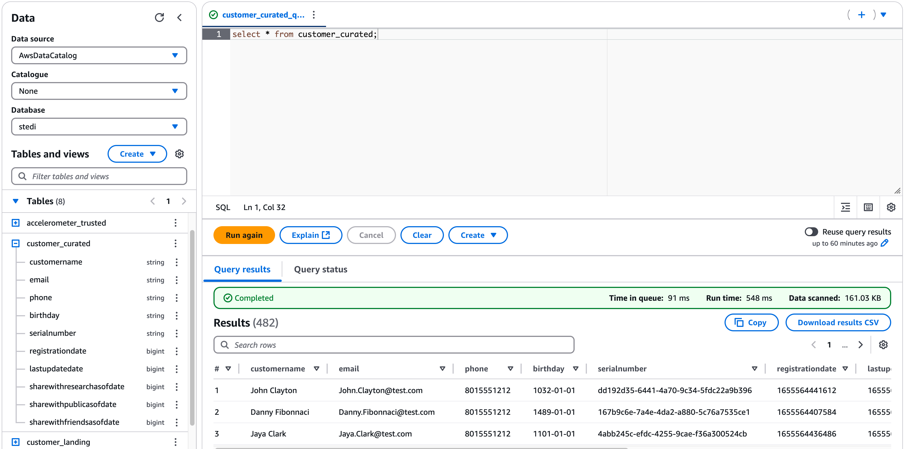
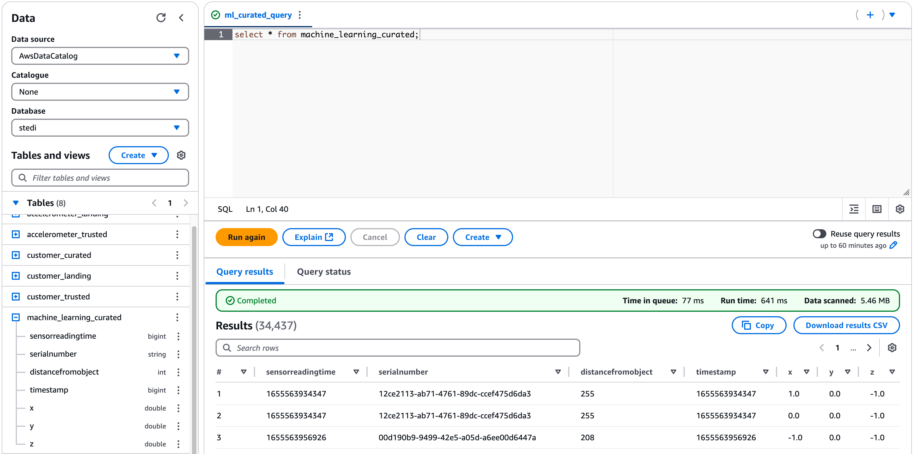

# STEDI Step Trainer ETL Pipeline

## Project Overview
STEDI has developed a smart step trainer that helps users improve their exercise routines. The device uses sensors to collect motion and activity data, which will be used to train a machine learning model. A companion mobile app interacts with the device and gathers customer data.

This project involves building an ETL (Extract, Transform, Load) pipeline using an AWS-based stack, including S3, Glue, and Athena, along with Spark, to cleanse and process the collected data.

This project approach ensures data integrity, compliance, and usability for downstream applications.

---

## Architecture
The pipeline follows a **three-zone data lake architecture** on AWS:

### 1. Landing Zone (Raw Data)
- Stores raw, unprocessed data directly sourced from the STEDI device and customer app.

### 2. Trusted Zone (Cleaned & Filtered Data)
- Processes raw data to:
  - Remove duplicates & null entries
  - Filter only customers who **consented** to data sharing for research purposes.

### 3. Curated Zone (Analytics-Ready Datasets)
- Contains **final datasets** for downstream use:
  - **Machine learning training dataset** (for model development)
  - **Customer table** (for business analytics)

---

## Technologies Used

- **Storage:** Amazon S3 (Data Lake)
- **ETL Processing:** AWS Glue (Spark)
- **Querying:** Amazon Athena (SQL)
- **Data Formats:** JSON

---

## Prerequisites

- S3 bucket with separate zones:  
- IAM permissions for:  
  - S3  
  - Glue  
  - Athena  
- Dedicated Glue database (e.g., `stedi`)  

---

## Repository Structure

### AWS Glue ETL Scripts (Python)
The following Spark jobs process data between zones:

1. **`customer_landing_to_trusted.py`**  
   - Filters raw customer data (Landing Zone)  
   - Retains only customers who consented to data sharing  
   - Outputs to Customer Trusted Zone

2. **`customer_trusted_to_curated.py`**  
   - Further refines customer data (Trusted Zone)
   - Includes only customers with accelerometer readings  
   - Outputs to Customer Curated Zone

3. **`accelerometer_landing_to_trusted.py`**  
   - Processes mobile app accelerometer readings (Landing Zone) 
   - Keeps only data from consenting customers  
   - Stores sanitized output in Accelerometer Trusted Zone

4. **`step_trainer_trusted.py`**  
   - Processes IoT device data stream (Landing Zone)
   - Filters to consenting customers with accelerometer data (Curated Zone)
   - Stores filtered output in Step Trainer Trusted Zone

5. **`machine_learning_curated.py`**  
   - Creates aggregated training dataset  
   - Joins step trainer and accelerometer readings by timestamp (Trusted Zone)
   - Includes only consenting customers and complies to privacy issues
   - Outputs to Step Trainer Curated Zone

### Database Schema Files (SQL)
DDL scripts for creating AWS Glue tables that reference raw data in S3:

- **`customer_landing.sql`**  
  Defines schema for raw customer data (JSON) from the mobile app.

- **`accelerometer_landing.sql`**  
  Creates table structure for raw accelerometer readings (JSON).

- **`step_trainer_landing.sql`**  
  Sets up schema for raw Step Trainer device (IoT sensor) data (JSON).

---

## Final Dataset Queries

- Customer Curated table

- Machine Learning Curated table

